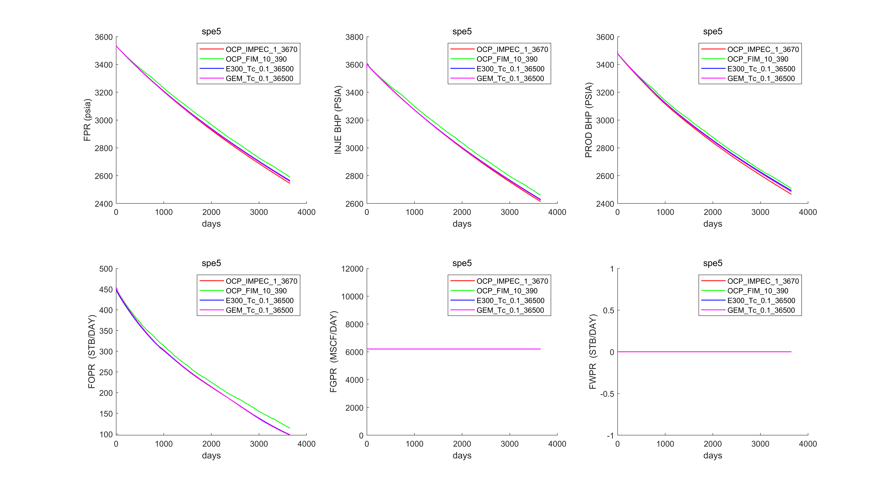
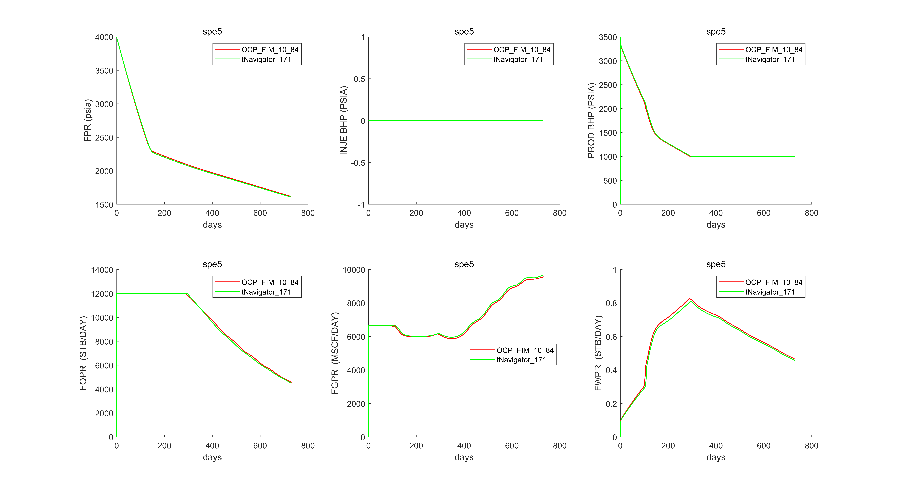

# Numerical Results for Comparison

## SPE1A


```
---------------------------------------------------
OCP_IMPEC_1

.\OpenCAEPoro.exe ..\..\examples\spe1a\spe1a.data  method=IMPEC  dtInit=0.1 dtMax=1 dtMin=0.1

Final time:          3655.500 Days
Total time steps:    4633
Total Newton steps:  4633 (+47 wasted steps)
Total linear steps:  7748 (+91 wasted steps)
Linear solve time:   0.772s (56.857%)
Simulation time:     1.357s


---------------------------------------------------
OCP_FIM_10

.\OpenCAEPoro.exe ..\..\examples\spe1a\spe1a.data  method=FIM  dtInit=1 dtMax=100 dtMin=0.1

precond_type             = 69

Final time:          3655.500 Days
Total time steps:    64
Total Newton steps:  147 (+2 wasted steps)
Total linear steps:  2274 (+34 wasted steps)
Linear solve time:   0.162s (52.650%)
Simulation time:     0.308s
```


## SPE1B


```
---------------------------------------------------
OCP_IMPEC_1

.\OpenCAEPoro.exe ..\..\examples\spe1b\spe1b.data  method=IMPEC  dtInit=0.1 dtMax=1 dtMin=0.1

Final time:          3655.500 Days
Total time steps:    3852
Total Newton steps:  3852 (+8 wasted steps)
Total linear steps:  7209 (+14 wasted steps)
Linear solve time:   0.659s (58.432%)
Simulation time:     1.127s


---------------------------------------------------
OCP_FIM_10

.\OpenCAEPoro.exe ..\..\examples\spe1b\spe1b.data  method=FIM  dtInit=1 dtMax=100 dtMin=0.1

precond_type             = 69

Final time:          3655.500 Days
Total time steps:    75
Total Newton steps:  175 (+2 wasted steps)
Total linear steps:  2599 (+37 wasted steps)
Linear solve time:   0.189s (53.695%)
Simulation time:     0.352s
```


## SPE9


```
---------------------------------------------------
OCP_IMPEC_1

.\OpenCAEPoro.exe ..\..\examples\spe9\spe9_IMPEC.data

Final time:          900.000 Days
Total time steps:    7486
Total Newton steps:  7486 (+42 wasted steps)
Total linear steps:  9900 (+96 wasted steps)
Linear solve time:   55.246s (62.154%)
Simulation time:     88.885s


---------------------------------------------------
OCP_FIM_10

.\OpenCAEPoro.exe ..\..\examples\spe9\spe9_FIM.data

precond_type             = 69

Final time:          900.000 Days
Total time steps:    140
Total Newton steps:  185 (+67 wasted steps)
Total linear steps:  2751 (+852 wasted steps)
Linear solve time:   7.817s (52.918%)
Simulation time:     14.771s
```


## SPE10


```
---------------------------------------------------
PS_FIM

Final time:          2000 Days
Total time steps:    53
Total Newton steps:  215
Wasted Newton steps: 5
Total linear steps:  1305
Linear solver time:  1413.86s
Simulation time:     2905.24s

---------------------------------------------------
OCP_FIM

.\OpenCAEPoro.exe ..\..\examples\spe10\spe10.data

Final time:          2000.000 Days
Total time steps:    53
Total Newton steps:  215 (+5 wasted steps)
Total linear steps:  1278 (+40 wasted steps)
Linear solve time:   1343.855s (73.547%)
Simulation time:     1827.200s
```


## CP


```
---------------------------------------------------
OCP_IMPEC_1

.\OpenCAEPoro.exe ..\..\examples\cornerpoint\CP.data  method=IMPEC  dtInit=0.1 dtMax=1 dtMin=0.1

Final time:          1000.000 Days
Total time steps:    1999
Total Newton steps:  1999 (+3 wasted steps)
Total linear steps:  13542 (+35 wasted steps)
Linear solve time:   0.044s (29.720%)
Simulation time:     0.148s


---------------------------------------------------
OCP_FIM_10

.\OpenCAEPoro.exe ..\..\examples\cornerpoint\CP.data  method=FIM  dtInit=1 dtMax=100 dtMin=0.1
 
precond_type             = 69

Final time:          1000.000 Days
Total time steps:    66
Total Newton steps:  154 (+3 wasted steps)
Total linear steps:  1582 (+24 wasted steps)
Linear solve time:   0.024s (25.256%)
Simulation time:     0.096s

```


## SPE5


```
---------------------------------------------------
OCP_IMPEC

.\OpenCAEPoro.exe ..\..\examples\spe5\spe5.data  method=IMPEC  dtInit=0.1 dtMax=1 dtMin=0.1

SSMSTA:     6347464
NRSTA:      20264
SSMSP:      9455434
NRSP:       1665916
=========================================
Final time:          7305.000 Days
Total time steps:    10791
Total Newton steps:  10791 (+25 wasted steps)
Total linear steps:  17352 (+49 wasted steps)
Linear solve time:   1.140s (8.054%)
Simulation time:     14.159s


---------------------------------------------------
OCP_FIM

.\OpenCAEPoro.exe ..\..\examples\spe5\spe5.data  method=FIM  dtInit=1 dtMax=50 dtMin=0.1

precond_type             = 64

SSMSTA:     549520
NRSTA:      2639
SSMSP:      769094
NRSP:       120125
=========================================
Final time:          7305.000 Days
Total time steps:    311
Total Newton steps:  767 (+23 wasted steps)
Total linear steps:  2500 (+66 wasted steps)
Linear solve time:   6.473s (79.102%)
Simulation time:     8.183s

---------------------------------------------------
OCP_FIMn

.\OpenCAEPoro.exe ..\..\examples\spe5\spe5.data  method=FIMn  dtInit=1 dtMax=50 dtMin=0.1

precond_type             = 64

SSMSTA:     638384
NRSTA:      4939
SSMSP:      910204
NRSP:       128626
=========================================
Final time:          7305.000 Days
Total time steps:    304
Total Newton steps:  807 (+36 wasted steps)
Total linear steps:  2573 (+177 wasted steps)
Linear solve time:   6.819s (76.855%)
Simulation time:     8.873s

```


## SPE3



```
---------------------------------------------------
OCP_IMPEC

.\OpenCAEPoro.exe ..\..\examples\spe3\spe3.data  method=IMPEC  dtInit=0.1 dtMax=1 dtMin=0.1

SSMSTA:     23725633
NRSTA:      19451
SSMSP:      23979137
NRSP:       1462997
=========================================
Final time:          3650.000 Days
Total time steps:    3652
Total Newton steps:  3652 (+0 wasted steps)
Total linear steps:  7307 (+0 wasted steps)
Linear solve time:   1.042s (2.698%)
Simulation time:     38.641s

---------------------------------------------------
OCP_FIM

.\OpenCAEPoro.exe ..\..\examples\spe3\spe3.data  method=FIM  dtInit=1 dtMax=100 dtMin=0.1

precond_type             = 64

SSMSTA:     750655
NRSTA:      4772
SSMSP:      884275
NRSP:       38973
=========================================
Final time:          3650.000 Days
Total time steps:    46
Total Newton steps:  80 (+0 wasted steps)
Total linear steps:  121 (+0 wasted steps)
Linear solve time:   0.668s (29.790%)
Simulation time:     2.243s


---------------------------------------------------
OCP_FIMn

.\OpenCAEPoro.exe ..\..\examples\spe3\spe3.data  method=FIMn  dtInit=1 dtMax=100 dtMin=0.1

precond_type             = 64

SSMSTA:     777437
NRSTA:      4900
SSMSP:      874045
NRSP:       40469
=========================================
Final time:          3650.000 Days
Total time steps:    46
Total Newton steps:  86 (+0 wasted steps)
Total linear steps:  132 (+0 wasted steps)
Linear solve time:   0.773s (30.430%)
Simulation time:     2.540s
```

## SPE5r

```
---------------------------------------------------
OCP_FIM

.\OpenCAEPoro.exe ..\..\examples\spe5refine\spe5-70x70x30-2y.data  method=FIM  dtInit=1 dtMax=10  dtMin=0.1  pl=1

precond_type   =  64

SSMSTA:     185640490
NRSTA:      76
SSMSP:      140723299
NRSP:       50135363
=========================================
Final time:          730.000 Days
Total time steps:    82
Total Newton steps:  260 (+27 wasted steps)
Total linear steps:  896 (+87 wasted steps)
Linear solve time:   542.995s (47.367%)
Simulation time:     1146.347s

.\OpenCAEPoro.exe ..\..\examples\spe5refine\spe5-70x70x30-2y.data  method=FIM  dtInit=1 dtMax=20  dtMin=0.1  pl=1

precond_type   =  64

SSMSTA:     157185627
NRSTA:      81
SSMSP:      115716480
NRSP:       41758653
=========================================
Final time:          730.000 Days
Total time steps:    48
Total Newton steps:  213 (+24 wasted steps)
Total linear steps:  790 (+77 wasted steps)
Linear solve time:   465.497s (48.439%)
Simulation time:     961.001s


.\OpenCAEPoro.exe ..\..\examples\spe5refine\spe5-70x70x30-2y.data  FIM  1  50  0.1

precond_type   =  64

SSMSTA:     190604401
NRSTA:      117
SSMSP:      149990315
NRSP:       56039151
=========================================
Final time:          730.000 Days
Total time steps:    47
Total Newton steps:  213 (+85 wasted steps)
Total linear steps:  781 (+442 wasted steps)
Linear solve time:   687.898s (48.709%)
Simulation time:     1412.269s

---------------------------------------------------
OCP_NEW_FIM

.\OpenCAEPoro.exe ..\..\examples\spe5refine\spe5-70x70x30-2y.data  FIMn  1  10  0.1

precond_type   =  64

SSMSTA:     180930118
NRSTA:      80
SSMSP:      140805797
NRSP:       50478353
=========================================
Final time:          730.000 Days
Total time steps:    80
Total Newton steps:  252 (+14 wasted steps)
Total linear steps:  864 (+24 wasted steps)
Linear solve time:   552.229s (42.005%)
Simulation time:     1314.664s

.\OpenCAEPoro.exe ..\..\examples\spe5refine\spe5-70x70x30-2y.data  FIMn  1  20  0.1

precond_type   =  64

SSMSTA:     178769093
NRSTA:      72
SSMSP:      124291924
NRSP:       45607746
=========================================
Final time:          730.000 Days
Total time steps:    50
Total Newton steps:  218 (+34 wasted steps)
Total linear steps:  807 (+112 wasted steps)
Linear solve time:   545.601s (43.609%)
Simulation time:     1251.113s

.\OpenCAEPoro.exe ..\..\examples\spe5refine\spe5-70x70x30-2y.data  FIMn  1  50  0.1

precond_type   =  64

SSMSTA:     193803346
NRSTA:      86
SSMSP:      160981671
NRSP:       60714439
=========================================
Final time:          730.000 Days
Total time steps:    50
Total Newton steps:  210 (+93 wasted steps)
Total linear steps:  757 (+397 wasted steps)
Linear solve time:   665.262s (43.112%)
Simulation time:     1543.095s

```