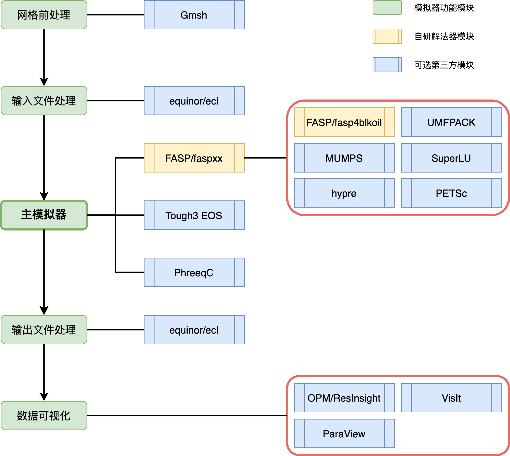
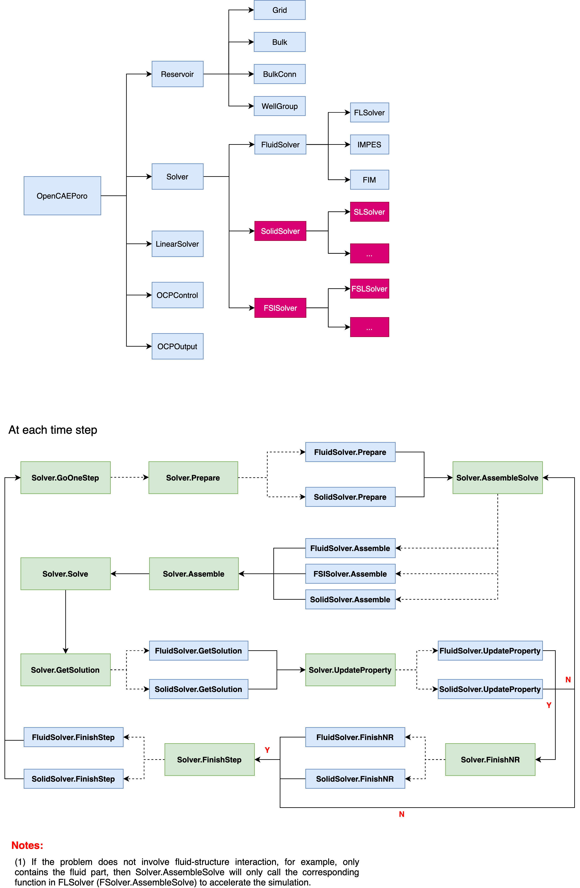

# Design Goals

## For users

- Easy to switch to a new EOS model
- Easy to switch to another **Flash Calculation** algorithm
- Easy to add a new IMPES/IMPEC method

## For developers
- Easy to change to a different grid structure
- Easy to add a new spatial discretization
- Easy to add a new temporal discretization
  
## For optimzation
- Easy to add a new linear solution method
- Easy to parallelize linear solvers
- Easy to optimize code at certain steps

## Linear solvers

## Flow chart

## Linear solvers

## Parallel module
